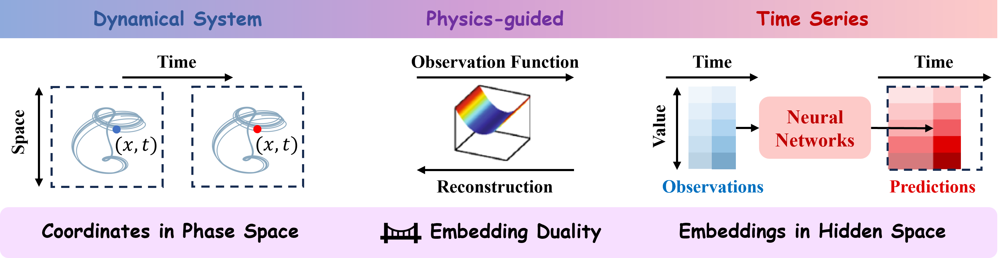
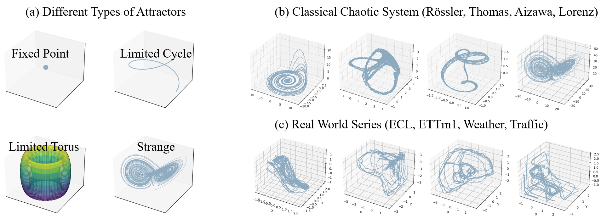
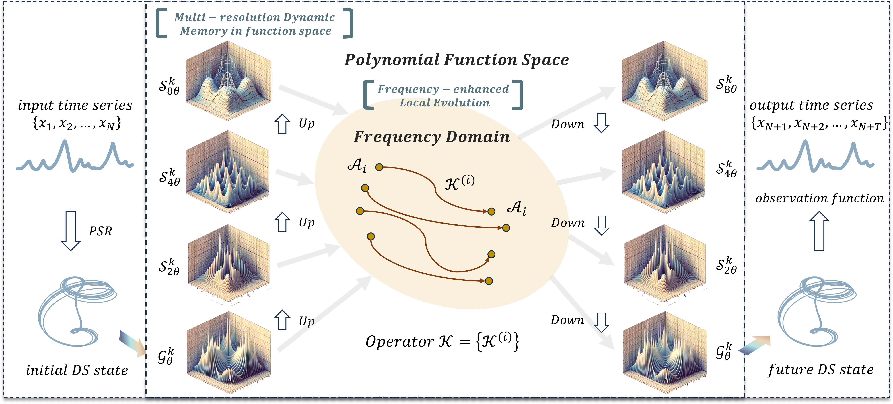
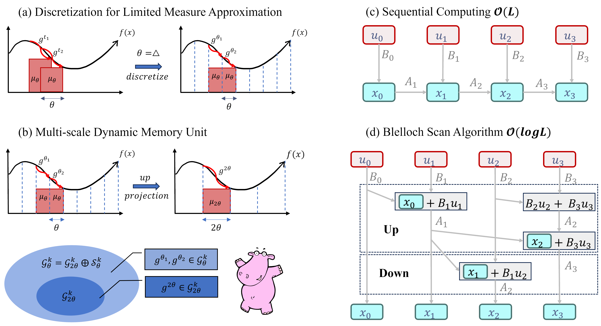
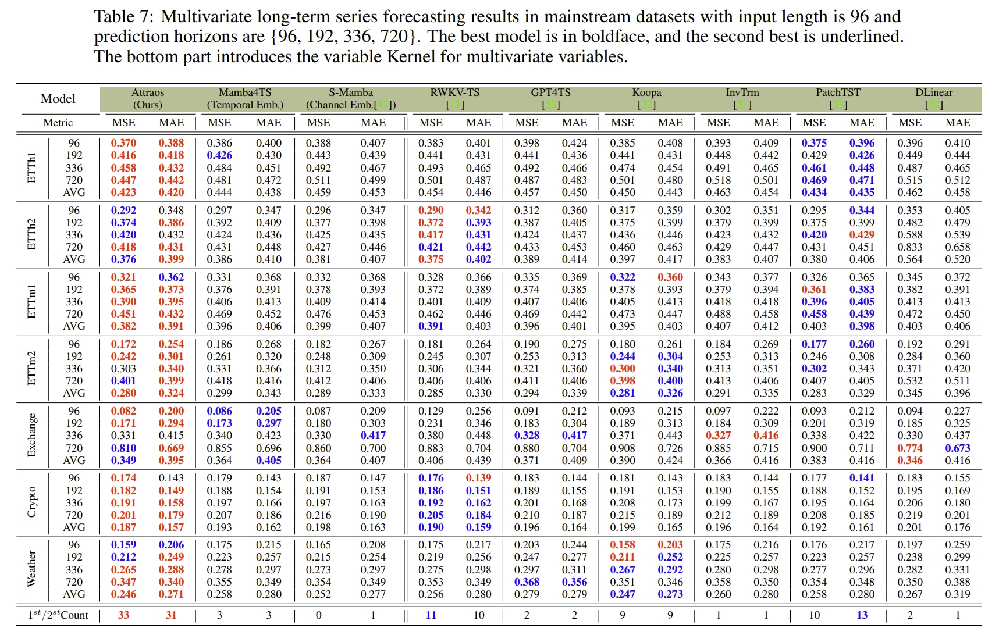

<div align="center">
    
# [NeurIPS2024] Attractor memory for long-term time series forecasting: A chaos perspective  
[Paper Link](https://arxiv.org/pdf/2402.11463) | [Openreview](https://openreview.net/forum?id=fEYHZzN7kX&referrer=%5BAuthor%20Console%5D(%2Fgroup%3Fid%3DNeurIPS.cc%2F2024%2FConference%2FAuthors%23your-submissions))  

<div align="center">  
  
</div>


This is an official implementation of Attraos, which incorporates chaos theory
into Time Series Forecasting, perceiving real-world time series as observations from unknown high-dimensional chaotic dynamic systems. 


</div>

<p align="center">
      🎉&nbsp;<a href="#-what's-new">What's New</a>
    | 📊&nbsp;<a href="#-physics-guided-time-series">Physics-guided Time Series</a>
    | 🔍&nbsp;<a href="#-about">About</a>
    | 🚀&nbsp;<a href="#-quick-start">Quick Start</a>
    | 👀&nbsp;<a href="#-evaluation">Evaluation</a>
    | 🔗&nbsp;<a href="#-citation">Citation</a>
</p>


## 🎉 What's New

* Oct 2024: We have introduced a plug-and-play [physical embedding module](https://arxiv.org/pdf/2410.06651) that boosts performance by 50%, reduces model parameters by 10x, and speeds up computations by 3x.

* Oct 2024: Code released.

* Sep 2024: Accepted as a poster in NeurIPS2024.

## 📊 Physics-guided Time Series
### Next Generation Time Series Model: [Toward Physics-guided Time Series Embedding](https://arxiv.org/pdf/2410.06651)

In reality, time series fundamentally stem from high-dimensional physical systems as noisy low-dimensional observations. Our recent paper [Toward Physics-guided Time Series Embedding](https://arxiv.org/pdf/2410.06651) achieved remarkable improvements (exceeding 50%) across all 8 task metrics and various neural network architectures by directly utilizing the latent dynamical representations of time series data in lieu of parameterized embedding layers in deep time series models.
<div align="center">

</div>


## ✅ TODO

- [ ] Improve docstrings and documentation

- [ ] Validating Attraos' performance on large-scale chaotic datasets

## 🔍 About
Chaos systems are a particular class of dynamical systems where linear or complex nonlinear systems, after sufficient evolution, exhibit stable patterns in their trajectories known as attractors. This paper initially observes striking similarities between the real-world time series data and classical chaotic systems. Consequently, we hypothesize that real-world time series originate from unknown high-dimensional chaotic systems, manifesting as noisy low-dimensional observations, and seek to enhance model predictive performance and interpretability through attractor invariance.
<div align="center">

</div>

----

Attraos employs a non-parametric phase space reconstruction method to recover the dynamical structure of time series and introduces a Multi-Resolution Dynamic Memory Unit (MDMU) to memorize the structural dynamics in historical sampled data. Specifically, leveraging polynomials as universal approximators for dynamical systems, MDMU extends the operation of State Space Models (SSM) to piecewise polynomial approximations, hierarchically representing the state space. Additionally, we devise a frequency-enhanced local evolution strategy: for dynamical system components belonging to the same attractor, Attraos applies a consistent evolution operator to predict their future states in the frequency domain.
<div align="center">

</div>

----

Drawing inspiration from the Blelloch algorithm and hierarchical projection, both of which are tree-structured operations, we propose an implicit computation approach that achieves logarithmic complexity by storing intermediate results. Odd-position output values are computed through an up-sweep, while even-position values are calculated through a down-sweep.
<div align="center">

</div>

## 🚀 Quick Start
1. Clone repository:
```shell
git clone https://github.com/CityMind-Lab/NeurIPS24-Attraos.git
```

2) Build environment:
```shell
pip install -e '.[notebook]'
```

2) Run in ETTh1 dataset:
```shell
bash ./scripts/ETTh1.sh
```

## 👀 Evaluation

<div align="center">

</div>


## 🔗 Citation

```bibtex
@article{hu2024attractor,
  title={Attractor memory for long-term time series forecasting: A chaos perspective},
  author={Hu, Jiaxi and Hu, Yuehong and Chen, Wei and Jin, Ming and Pan, Shirui and Wen, Qingsong and Liang, Yuxuan},
  journal={arXiv preprint arXiv:2402.11463},
  year={2024}
}
```

```bibtex
@article{hu2024toward,
  title={Toward Physics-guided Time Series Embedding},
  author={Hu, Jiaxi and Zhang, Bowen and Wen, Qingsong and Tsung, Fugee and Liang, Yuxuan},
  journal={arXiv preprint arXiv:2410.06651},
  year={2024}
}
```

